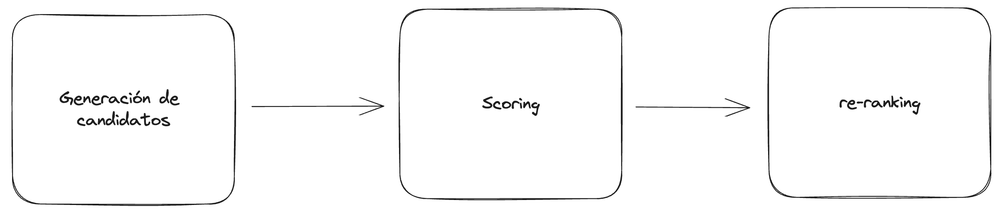

# Sistemas de recommendación:

En esta sección vamos a ver un poco sobre los sistemas de recomendación y como nuestro pequeño frankenstein de recomendador entra en este mundo.

{: .center}

!!! note
    Hay mucho más contenido a cerca del tema y se puede encontrar en el siguiente [link](https://developers.google.com/machine-learning/recommendation)

## Primero: Que es sistema de recommendación:
SI uno busca en internet encuentra multiples definiciones de este termino, con varios grados de certeza y 
profundidad. Pero para nuestros fines prácticos vamos a ver una noción que sea válida y sin muchos terminos
fancy.

{: .center}

En criollo, un sistema de recomendación es simplemente un programa que toma en cuenta ciertas variables de interés,
como puede ser tus preferencias previas, algún atributo propio del objeto de recomendación, interacciones previas, etc.

La idea, es una caja negra a la que le metemos un par de datos y automágicamente nos devuelve posibles cosas que ,esperamos,
sean de nuetro interés.

{: .center}

## Tipos de sistemas:

Okey, ahora tenemos una idea medio vaga de que es un sistema de recomendación. Pero tal vez, te estes preguntando como esta idea 
funciona para cosas tan distintas como instagram, tiktok, youtube, netflix spotify, etc; y la realidad es que cada uno de esos 
productos tiene su pequeño monstruo interno que está optimizado para cada plataforma. 

{: .center}

Ahora bien, lo que si debemos entender es que hay una distinción entre aquellos sistemas que utilizan datos de otro usuarios,
 de aquellos sistemas que se basan unicamente en la información del producto y del usuario en particular.
El primero, se lo conoce como **Collaborative Filtering** mientras que el segundo es llamado **Content based filtering**. Esta
distinciôn, es para saber si el sistema utiliza información sobre como otros usuarios interactuaron con un producto para determinar
si el mismo es de interés para nosotros o, en su defecto, utiliza informaciôn únicamente sobre nuestras prefernecias y las 
caracterîsticas de cada producto.

La gran diferencia, es que unos se basan en la hipotesis de que si otras personas con gustos similares les interesó algo... muy 
probablemente nos interese a nosotros también. En cambio, el otro tipo de sistemas, se basa únicamente en nuestro comportamiento
individual y lo que conoce de los productos para recomendarnos algo nuevo. 

En nuestro caso, `Kmusic` se encuentra dentro de la categoria de **Content Based** dado que solo utilizamos la poca información
que nos proporciona el usuario más las caraterísticas que conocemos de cada canción para recoemndar.

!!! note
    Usualmente las grandes empresas utilizan sistemas hibridos que utilizan ambos tipos de información para mejorar los resultados.

## Partes de un sistema de recomendación:

En general, un sistema de recomendación consta de multiples etapas donde cada una puede ser suficientemente compleja como para estudiar 
una vida entera y todavía no entender como funcionan. Pero sin meternos en detalles, tratemos de simplificar en terminos que podamos manejar:

En este esquema, hay 3 aspectos que nos interesan.

### Generación de candidatos:

Esta etapa se refiere al paso en el que tomamos nuestra base de conocimiento (en nuestro caso, la base de canciones que tenemos)
y hacemos una busqueda rápida para encontrar elementos que *posiblemente* sean de interes.  Este paso puede darnos muchos falsos-positivos 
(ejemplos que al final no serán de nuestro interés) pero lo importante es que **reduce** la cantidad de opciones a mirar.
No es lo mismo tener que recomendarte 1 canción de un listado de millones que darte una recomendaciôn de entre 10. 

!!! note
    Piesen en el tiempo que tardarían en elegir 2 gustos de helado de un tablero de 50 posibilidades, comparado al tiempo
    que tardarían si solo tuvieran 5 opciones. Este fenomeno es conocido como "*The paradox of choice*" y nos afecta en muchos
    aspectos de la vida cotidiana.

### Scoring:

En la etapa de Scoring lo que hacemos es tomar cada uno de los elementos que nos devolvió la etapa atenrior y re evaluamos si 
realmente son de interés para el usuario o no. Usualemnte esta etapa es donde se corren algoritmos más avanzados de inteligencia
artificial como redes neuronales. El objetivo es eliminar posibles falsos positivos y dejar solo elementos que sean relevantes.

### ReRanking:

Finalmente, luego de filtrar solo los elementos relevantes pasamos al último paso que es *re ranking*. Aquí es donde determinamos cual 
es el mejor orden para mostrar los resultados al usuario. Bien sabemos que el usuario promedio prefiere hacer una segunda búsqueda que 
mirar una lista muy larga (y si piensan que no .... preguntense cuantas veces llegan a la página 2 o 3 de google cuando buscan algo).

Este proceso es completamente dominado por el conocimiento que tenemos del usuario, dependientemente de si estamos creando un sistema
de tipo **colaborative filtering** o **content based**.
