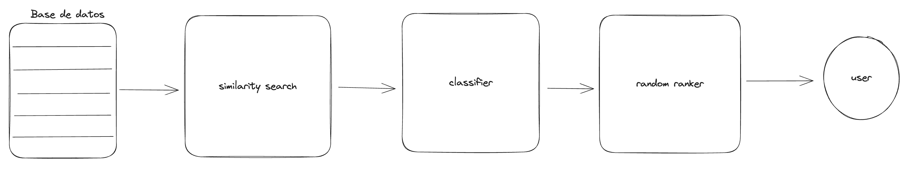

# **Kmusic**

En esta sección vamos a analizar como está compuesto `Kmuisc`, es recomendable haber leído la
introducciôn a sistemas de recommendación dado que ahí se enuncian ciertos conceptos generales 
que utilizaremos.

## Data:
EN todo proyecto de AI
-  algo fundamental es entender que data tenemos disponible. En nuestro caso,
dado estaremos utilizando un conjunto de 1 millón de canciones publicado utilizando la base de datos 
de Spotify. 

Este conjunto de datos, tiene las siguientes características sobre cada canción:

- `artist_name`
- `track_name`
- `track_id`
- `popularity`
- `year`
- `genre`
- `danceability`
- `energy`
- `key`
- `loudness`
- `mode`
- `speechiness`
- `acousticness`
- `instrumentalness`
- `liveness`
- `valence`
- `tempo`
- `duration_ms`
- `time_signature`

La explicación sobre que representa cada una y su detalle sobre la composición se puede ver [aqui](https://www.kaggle.com/datasets/amitanshjoshi/spotify-1million-tracks/). Para nuestro caso, utilizaremos solo aquellos atributos que tengan valores continuos (no sean categorías).

El conjunto, posee canciones que datan desde los años 2000 en adelante, por lo que esto es importante a la hora de la distribución. Dado que los gustos musicales fueron cambian con el pasar de las decadas, hay ciertos patrones sobre atributos como `danceability` o `acousticness` que cambiarían ampliamente en otras epocas musicales.

## Modelo:

Siguiendo el modelo que vimos en la sección de sistemas de recomendación, podemos decir que nuestro sistema cae en la categoría de **content based filtering** dado que nos basamos exlusivamente sobre la información que obtenemos de las canciones para dar recomendaciones y no tomamos en cuenta el parecido entre distintos usuarios. Al punto donde si un usuario ingresa dos búsquedas distintas obtendrá resultados completamente distintos.

Ahora bien, veamos como es un diagrama sencillo de nuestro modelo:

